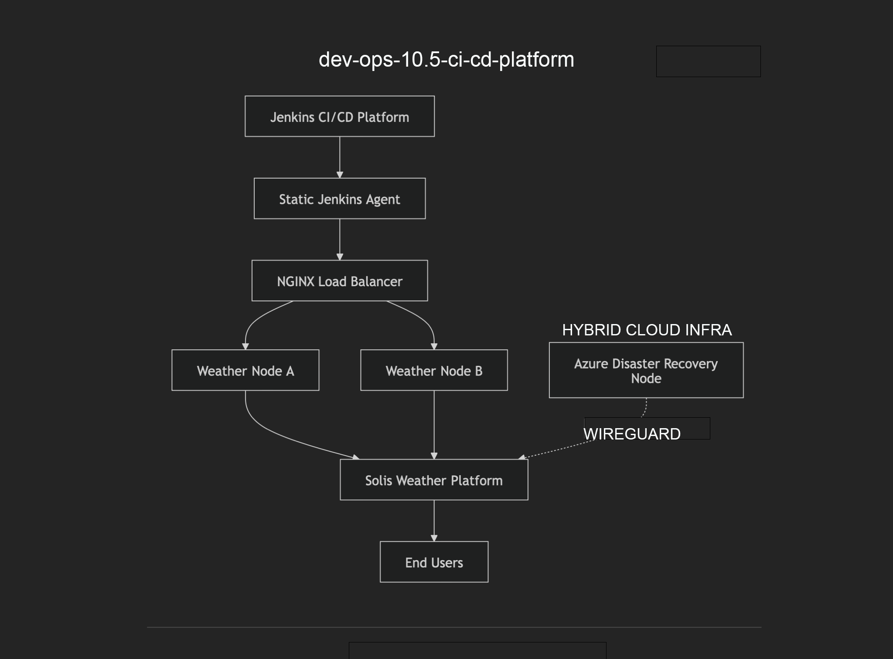
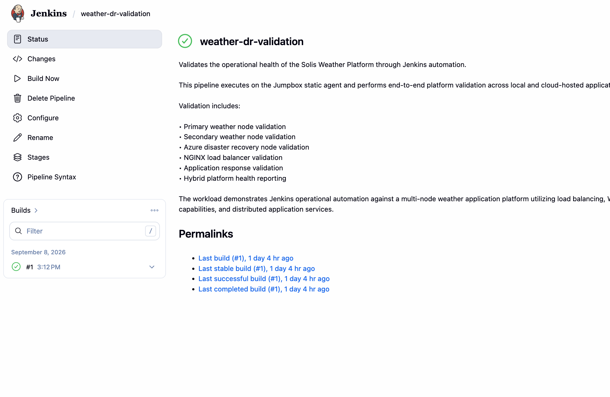
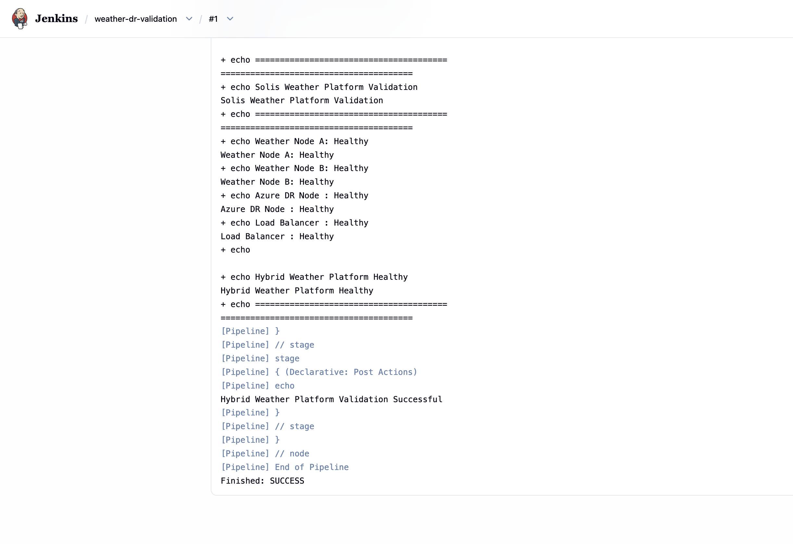
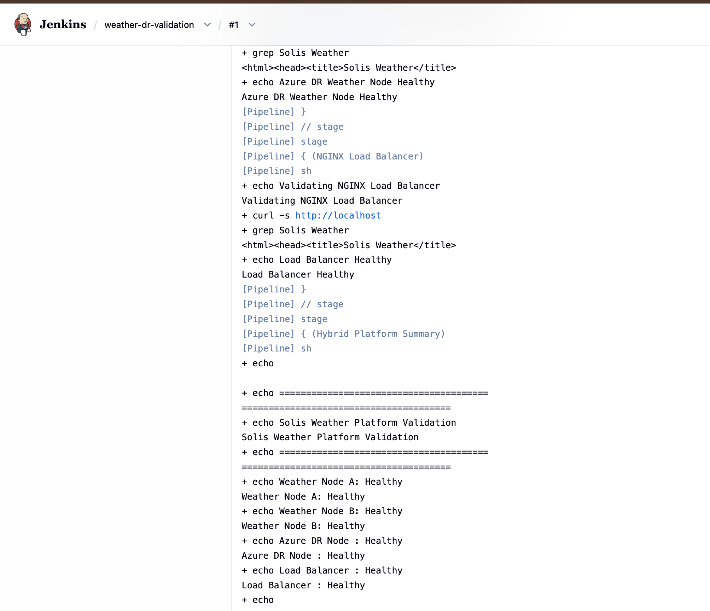

# Dev-Ops-10.5 CI/CD Platform



## Overview

### From Manual Builds to Automated Delivery

The CI/CD Platform is a companion project to the Kubernetes Platform Engineering & Operations Platform. The project focuses on source control integration, pipeline automation, continuous integration, build orchestration, Jenkins agent architectures, and future Kubernetes-native delivery workflows using Jenkins and GitHub.

This platform provides a dedicated environment for validating Pipeline-as-Code practices, credential management, automated build triggers, traditional Jenkins agents, Kubernetes-based dynamic agents, and future containerized build execution.

The platform has evolved from a standalone Jenkins deployment into a dedicated CI/CD platform capable of orchestrating builds across controller executors, traditional agent nodes, and Kubernetes-based agent infrastructure.

## Portfolio Relationship

The CI/CD Platform complements the Kubernetes Platform Engineering & Operations Platform.

While Dev-Ops-10 focuses on Kubernetes infrastructure, storage, ingress, networking, observability, and platform operations, Dev-Ops-10.5 focuses on software delivery, continuous integration, pipeline management, build orchestration, and deployment automation.

Together the platforms support the following workflow:

GitHub
↓
Jenkins
↓
Kubernetes
↓
Application Delivery

Dev-Ops-10 provides the infrastructure foundation while Dev-Ops-10.5 provides the automation and delivery layer.

### Platform Relationship 
```text
Dev-Ops-10
(Kubernetes Platform Engineering)

        ↓

Dev-Ops-10.5
(CI/CD Platform)

        ↓

Application Delivery & Operational Validation
```
## Project Origin

This project originated from the need to build a dedicated CI/CD environment capable of integrating source control, automation workflows, and future Kubernetes deployment pipelines.

The platform was developed as a companion project to the Kubernetes Platform Engineering & Operations Platform to validate GitHub integration, Pipeline-as-Code, build automation, agent-based execution, and future deployment workflows.

## Project Status

Current Status: Operational

### Phase 1 Complete

- Jenkins Deployment
- SMB CSI Persistent Storage
- HTTPS Access
- GitHub Integration
- Pipeline-as-Code
- Poll SCM Automation

### Phase 2 Complete

- Traditional Jenkins Agent
- SSH Connectivity
- Agent Registration
- Build Worker Architecture

### Phase 3 Infrastructure Complete

- Kubernetes Cloud Integration
- Service Account Authentication
- RBAC Configuration
- Kubernetes Agent Templates

### Phase 4 Complete

- Static Agent Pipeline Validation
- Dynamic Kubernetes Agent Validation
- Operational Workload Validation
- Weather Platform Validation
- Hybrid Infrastructure Validation
- Azure Disaster Recovery Validation

### Next Phase

- Screenshots Documentation
- Architecture Diagrams
- Documentation Finalization

## Objectives

- Integrate Jenkins with GitHub.
- Develop and validate pipeline workflows.
- Implement Pipeline-as-Code.
- Implement automated build triggers.
- Implement traditional Jenkins agents.
- Implement Kubernetes agent architecture.
- Validate dynamic build execution.
- Establish CI/CD operational patterns for future platform integration.

## Environment

- GitHub
- Jenkins
- Kubernetes
- SMB CSI Storage
- NGINX Ingress
- HTTPS
- Git
- Traditional Jenkins Agents
- Kubernetes Cloud Integration

## Technology Stack

### Jenkins Plugins

- Kubernetes
- Docker
- Docker Pipeline
- Pipeline Utility Steps
- AnsiColor
- Timestamper

### Source Control

- Git
- GitHub

### CI/CD Platform

- Jenkins 2.568.3
- Declarative Pipelines
- Pipeline-as-Code
- Jenkins Agents
- Poll SCM

### Languages

- Groovy
- Bash
- YAML

### Cloud Services

- Microsoft Azure
- Azure Virtual Machines

### Container Platform

- Kubernetes
- kubectl

### Storage

- SMB CSI Driver
- Persistent Volumes
- Persistent Volume Claims

### Networking

- NGINX Ingress
- HTTPS
- Internal DNS

### Security & Authentication

- Jenkins Credentials Store
- GitHub Fine-Grained Personal Access Tokens
- SSH Agent Authentication

## CI/CD Platform Components

### GitHub Repository

A dedicated GitHub repository hosts project documentation and Jenkins pipeline definitions. The repository serves as the source of truth for Pipeline-as-Code workflows.

### Jenkins Controller

Jenkins is deployed on Kubernetes using persistent SMB-backed storage and secured using HTTPS access.

The controller manages:

- Pipeline orchestration
- Job scheduling
- Credential management
- Agent coordination
- Build execution

### Traditional Jenkins Agent

A dedicated Linux-based Jenkins agent was deployed and validated using SSH connectivity.

Validated components:

- SSH authentication
- Java runtime
- Workspace management
- Agent connectivity
- Build execution

Primary use cases:

- Terraform
- Ansible
- Infrastructure Automation
- Administrative Automation
- Operational Runbooks

### Kubernetes Cloud

Jenkins has been integrated with Kubernetes Cloud functionality using Kubernetes plugin-based connectivity.

Validated components:

- Service Account
- RBAC
- Token Authentication
- Kubernetes Cloud Connectivity
- Agent Template Configuration

### Pipeline-as-Code

Pipeline definitions are maintained in source control using Jenkinsfiles. Pipeline changes are version controlled, auditable, and automatically executed by Jenkins.

### Credentials Management

GitHub integration is implemented using Fine-Grained Personal Access Tokens securely stored within the Jenkins credential store.

### Poll SCM Automation

Automated build triggering is implemented using Jenkins Poll SCM.

Workflow:

Git Push
→ GitHub
→ Poll SCM
→ Jenkins Pipeline
→ Build Execution

This approach allows automated builds without exposing the Jenkins environment to the public Internet.

## Architecture

### Build Execution Models

#### Controller Execution

Build executes directly on the Jenkins controller using available executors.

#### Traditional Agent Execution

Build executes remotely on a dedicated Linux worker using SSH connectivity.

Typical workloads:

- Terraform
- Ansible
- Git Operations
- Infrastructure Automation

#### Kubernetes Agent Execution

Build executes within dynamically provisioned Kubernetes pods.

Typical workloads:

- Container Builds
- Testing Pipelines
- CI/CD Validation
- Disposable Build Environments

### Current Architecture

GitHub
↓
Jenkins Controller
├── Built-In Executors
├── Traditional Agents
└── Kubernetes Cloud
↓
Pipeline Execution

The platform supports multiple build execution strategies depending on workload requirements.

#### Controller Execution

Builds execute directly on the Jenkins controller using available executors.

Typical use cases:

- Validation Jobs
- Lightweight Automation
- Administrative Tasks

#### Static Agent Execution

Builds execute on a dedicated Linux-based worker node.

Typical use cases:

- Infrastructure Automation
- Ansible
- Terraform
- Administrative Operations

Architecture:

GitHub
↓
Jenkins Controller
↓
Static Agent
↓
Pipeline Execution

#### Dynamic Kubernetes Agent Execution

Builds execute on dynamically provisioned Kubernetes workloads created on demand.

Typical use cases:

- CI/CD Workloads
- Application Builds
- Testing Pipelines
- Disposable Build Environments

Architecture:

GitHub
↓
Jenkins Controller
↓
Kubernetes Cloud
↓
Dynamic Agent Pod
↓
Pipeline Execution
↓
Automatic Cleanup

### Future Architecture

GitHub
↓
Jenkins Controller
↓
Kubernetes Agent Pods
↓
Build / Test / Package
↓
Artifact Management
↓
Deployment Automation
↓
Application Delivery

## Platform Capabilities

The platform provides a Kubernetes-hosted CI/CD environment designed for source control integration, automated build execution, pipeline orchestration, and future software delivery workflows.

Validated platform capabilities include:

- Jenkins Controller Operations
- GitHub Source Control Integration
- Pipeline-as-Code Workflows
- Static Agent Execution
- Dynamic Kubernetes Agent Execution
- Kubernetes Cloud Integration
- Automated Agent Provisioning
- Credential Management
- Build History Management
- Pipeline Visualization
- Workspace Management
- Multi-Agent Build Architecture
- Operational Workload Validation
- Platform Health Verification
- Hybrid Infrastructure Validation
- Disaster Recovery Validation
- Automated Service Availability Testing
- Load Balancer Validation
- Application Availability Validation
- Hybrid Cloud Connectivity Validation
- Operational Automation Workflows
## Operational Platform Validation

The CI/CD platform was validated using the Solis Weather Platform, a multi-node application platform consisting of load-balanced application services, hybrid infrastructure resources, and cloud-hosted disaster recovery capabilities.

Rather than limiting validation to synthetic demonstration jobs, Jenkins was used to execute automated operational validation workflows against a real application platform.

### Validation Architecture

Jenkins Controller
↓
Static Jenkins Agent
↓
Operational Validation Pipeline
↓
NGINX Load Balancer
↓
Weather Application Platform
├── Weather Node A
├── Weather Node B
└── Azure Disaster Recovery Node

### Validated Components

✅ Weather Application Node A Availability

✅ Weather Application Node B Availability

✅ NGINX Load Balancer Availability

✅ Azure Disaster Recovery Node Availability

✅ WireGuard Connectivity Validation

✅ End-to-End Application Availability

✅ Automated Platform Health Reporting

✅ Static Jenkins Agent Pipeline Execution

### Operational Outcome

The CI/CD platform successfully demonstrated automated operational validation capabilities across application services, load-balancing infrastructure, hybrid connectivity, and cloud-hosted disaster recovery resources.

This validation established the platform's ability to perform repeatable operational health verification workflows against distributed application services.

## Validation

### Validation Summary

✅ Jenkins Controller Deployment

✅ Kubernetes-Hosted CI/CD Platform

✅ Persistent SMB CSI Storage Integration

✅ HTTPS Platform Access

✅ GitHub Repository Integration

✅ Secure Source Control Authentication

✅ Repository Checkout and Workspace Management

✅ Pipeline-as-Code Implementation

✅ Multi-Stage Pipeline Execution

✅ Poll SCM Automation

✅ Automated Build Triggering

✅ Static Agent Execution

✅ Dynamic Kubernetes Agent Execution

✅ Kubernetes Cloud Integration

✅ Automated Agent Provisioning

✅ Kubernetes-Based Build Execution

✅ Credential Management

✅ Build History Management

✅ Pipeline Visualization

✅ Multi-Agent Build Architecture

### Jenkins Platform Validation

- Jenkins deployment validated.
- Persistent SMB CSI storage validated.
- HTTPS access validated.
- Jenkins upgrade process validated.
- Resource limits validated.
- Timezone configuration validated.

### GitHub Integration Validation

- Repository authentication validated.
- Jenkins credential management validated.
- Repository checkout validated.
- GitHub connectivity validated.

### Pipeline Validation

- Pipeline-as-Code validated.
- Multi-stage pipeline execution validated.
- Shell execution validated.
- Environment validation demonstrated.
- Git repository validation demonstrated.
- Pipeline summary reporting demonstrated.

### Automated Trigger Validation

- Poll SCM configured successfully.
- Automated source control polling validated.
- Automatic build execution validated.
- Builds successfully triggered by repository changes.
- SCM-triggered build execution validated.

### Agent Validation

#### Static Agent Architecture

- SSH connectivity validated.
- Agent registration validated.
- Workspace validation completed.
- Agent communication validated.
- Agent online status confirmed.
- Pipeline execution 

#### Dynamic Kubernetes Agent Architecture

- ServiceAccount integration validated.
- RBAC authorization validated.
- Cloud connectivity validated.
- Kubernetes Cloud registration validated.
- Agent template configuration validated.
- Dynamic agent provisioning validated.
- Automated agent cleanup validated.
- Kubernetes-based pipeline execution validated.

### Outcome

The platform successfully demonstrated end-to-end CI/CD functionality including source control integration, automated build triggering, Pipeline-as-Code workflows, static agent execution, dynamic Kubernetes agent execution, and Kubernetes-native build orchestration.

## Screenshots

### Operational Validation Project



Weather DR Validation pipeline providing automated operational validation across application services, load balancing infrastructure, and Azure-hosted disaster recovery resources.

### Operational Validation Success



Operational validation pipeline successfully verified Weather Node A, Weather Node B, Azure disaster recovery services, and load-balancer health.

### Hybrid Infrastructure Validation



Hybrid infrastructure validation confirming cloud connectivity, disaster recovery service availability, and load-balanced application health.

### Jenkins Workload Hosting


Jenkins controller successfully hosted and operated as a Kubernetes workload using SMB CSI-backed persistent storage.

## Architectural Observations

### Jenkins Platform Architecture

```text
Storage = Warehouse
Executors = Workbenches
Agents = Workers
Jenkins = Factory Manager
Kubernetes = Property Manager
```

### Operational Insights

- Persistent storage design can directly impact CI/CD platform behavior.
- SMB-backed storage introduced OpenSSH temporary key permission challenges when using GitHub Deploy Keys.
- Fine-Grained GitHub Personal Access Tokens provided a reliable authentication alternative.
- Private infrastructure limits the usability of GitHub-hosted webhooks.
- Poll SCM provides an effective automated build trigger mechanism for private environments.
- Pipeline-as-Code simplifies change management and operational consistency.
- Traditional agents remain valuable for infrastructure automation workloads.
- Kubernetes agents provide a path toward dynamic and disposable build execution.
- Executors represent build slots and should not be confused with agents or Kubernetes pods.
- Separating platform engineering and CI/CD engineering improves maintainability and scalability.

## Key Outcomes

- Successfully deployed Jenkins on Kubernetes.
- Implemented SMB CSI-backed persistent storage.
- Configured HTTPS access.
- Integrated Jenkins with GitHub.
- Implemented secure credential management.
- Developed Pipeline-as-Code workflows.
- Built and executed multi-stage Jenkins pipelines.
- Validated automated repository polling.
- Validated automatic build triggering through repository changes.
- Implemented traditional Jenkins agent architecture.
- Integrated Kubernetes Cloud functionality.
- Established a CI/CD foundation for future Kubernetes deployment automation.
- Validated static Jenkins agent execution architecture.
- Validated dynamic Kubernetes agent execution architecture.
- Implemented operational workload validation pipelines.
- Automated validation of a hybrid application platform.
- Validated load-balanced service availability.
- Validated cloud-hosted disaster recovery services.
- Validated WireGuard-connected hybrid infrastructure.
- Established automated platform health verification workflows.

## Example Pipeline

```groovy
pipeline {
    agent any

    stages {
        stage('Checkout Validation') {
            steps {
                echo 'Repository checkout successful'
            }
        }

        stage('Environment Validation') {
            steps {
                sh 'pwd'
                sh 'ls -la'
            }
        }

        stage('Git Validation') {
            steps {
                sh 'git rev-parse --short HEAD'
            }
        }

        stage('Build Validation') {
            steps {
                echo 'Build validation completed successfully'
            }
        }

        stage('Pipeline Summary') {
            steps {
                echo 'CI/CD platform validation successful'
            }
        }
    }
}
```

## Example Agent Pipeline

```groovy
pipeline {
    agent {
        label 'jumpbox'
    }

    stages {
        stage('Agent Validation') {
            steps {
                sh '''
                hostname
                whoami
                pwd
                '''
            }
        }
    }
}
```

## Example Kubernetes Agent Pipeline

```groovy
pipeline {
    agent {
        label 'kubernetes'
    }

    stages {
        stage('Kubernetes Agent Validation') {
            steps {
                sh '''
                hostname
                whoami
                pwd
                '''
            }
        }
    }
}
```

## Repository Structure

```text
dev-ops-10-5-ci-cd-platform/
├── README.md
├── Jenkinsfile
├── build-log.md
├── build-plan.md
├── changelog.md
├── docs/
│   ├── architecture.md
│   └── decisions.md
├── diagrams/
├── screenshots/
├── runbooks/
├── examples/
└── scripts/

## Status

### Completed

- Jenkins Deployment
- Persistent SMB Storage
- HTTPS Configuration
- GitHub Integration
- GitHub PAT Authentication
- Jenkins Credential Management
- Pipeline-as-Code
- Multi-Stage Pipeline Development
- Poll SCM Automation
- Automated Build Trigger Validation
- Traditional Jenkins Agent
- Kubernetes Cloud Integration
- Kubernetes Agent Template Creation
- America/Chicago Timezone Configuration

### In Progress

- Documentation Finalization
- Screenshots
- Architecture Diagrams

### Planned

- Container Image Build Automation
- Artifact Repository Integration
- Automated Testing Pipelines
- Deployment Pipelines
- GitOps Integration
- Jenkins Configuration as Code
- Kubernetes Deployment Automation
- Supply Chain Security Validation

## Key Architectural Decisions

- Jenkins hosted on Kubernetes
- SMB CSI persistent storage
- HTTPS through NGINX Ingress
- GitHub source control integration
- Pipeline-as-Code implementation
- GitHub PAT authentication strategy
- Poll SCM automation model
- Traditional infrastructure-focused build agent
- Kubernetes dynamic agent architecture
- Internal-only CI/CD platform design
- Static and dynamic agent execution model
- Operational workload validation strategy
- Hybrid infrastructure validation architecture
- Real-platform validation approach over synthetic test workloads

## Future Enhancements

- Dynamic Kubernetes Agent Pods
- Container Image Build Automation
- Artifact Repository Integration
- Automated Testing Pipelines
- Deployment Pipelines
- GitOps Integration
- Jenkins Configuration as Code
- Kubernetes Deployment Automation
- Security Scanning
- Supply Chain Validation
- AI-Assisted Pipeline Operations
